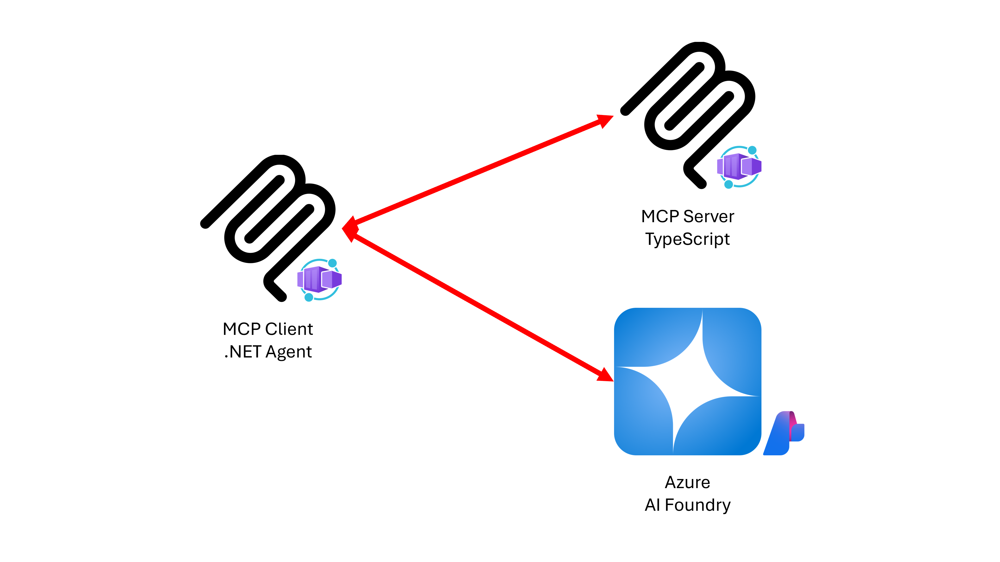

# .NET OpenAI MCP Agent

This is a sample AI agent app using OpenAI models with any MCP server.

## Features

This app provides features like:

- It is an MCP host + MCP client app written in .NET Blazor.
- The MCP client app connects to a to-do MCP server written in TypeScript.
- Both MCP client and server apps are running on [Azure Container Apps (ACA)](https://learn.microsoft.com/azure/container-apps/overview).
- The MCP client app is secured by the built-in auth of ACA.
- The MCP server app is not publicly accessible.



## Prerequisites

- [.NET 9 SDK](https://dotnet.microsoft.com/download/dotnet/9.0)
- [Visual Studio Code](https://code.visualstudio.com/Download) + [C# Dev Kit](https://marketplace.visualstudio.com/items?itemName=ms-dotnettools.csdevkit)
- [node.js](https://nodejs.org/en/download) LTS
- [Docker Desktop](https://docs.docker.com/get-started/get-docker/) or [Podman Desktop](https://podman-desktop.io/downloads)
- [Azure Subscription](https://azure.microsoft.com/free)

## Getting Started

You can now use GitHub Codespaces to run this sample app (takes several minutes to open it)! 👉 [](https://codespaces.new/Azure-Samples/openai-mcp-agent-dotnet).

### Run it locally

1. Clone this repo.

    ```bash
    git clone https://github.com/Azure-Samples/openai-mcp-agent-dotnet.git
    ```

1. Clone the MCP server.

    ```bash
    git clone https://github.com/Azure-Samples/mcp-container-ts.git ./src/McpTodo.ServerApp
    ```

1. Add Azure OpenAI API Key.

    ```bash
    dotnet user-secrets --project ./src/McpTodo.ClientApp set ConnectionStrings:openai "Endpoint={{AZURE_OPENAI_ENDPOINT}};Key={{AZURE_OPENAI_API_KEY}}"
    ```

   > **NOTE**: You can add GitHub PAT in the same format above to use GitHub Models like `Endpoint=https://models.inference.ai.azure.com;Key={{GITHUB_PAT}}`.

1. Install npm packages.

    ```bash
    pushd ./src/McpTodo.ServerApp
    npm install
    popd
    ```

1. Install NuGet packages.

    ```bash
    dotnet restore && dotnet build
    ```

1. Run the host app.

    ```bash
    cd ./src/McpTodo.ServerApp
    npm start
    ```

1. Run the client app in another terminal.

    ```bash
    dotnet watch run --project ./src/McpTodo.ClientApp
    ```

1. Navigate to `https://localhost:7256` or `http://localhost:5011` and enter prompts like:

    ```text
    Give me list of to do.
    Set "meeting at 1pm".
    Give me list of to do.
    Mark #1 as completed.
    Delete #1 from the to-do list.
    ```

### Run it in local containers

1. Make sure that you're running either Docker Desktop or Podman Desktop on your local machine.

1. Export user secrets to `.env`.

    ```bash
    # bash/zsh
    dotnet user-secrets list --project src/McpTodo.ClientApp \
        | sed 's/ConnectionStrings:openai/ConnectionStrings__openai/' > .env
    ```

    ```bash
    # PowerShell
    (dotnet user-secrets list --project src/McpTodo.ClientApp).Replace("ConnectionStrings:openai", "ConnectionStrings__openai") `
        | Out-File ".env" -Force
    ```

1. Run both apps in containers.

    ```bash
    # Docker
    docker compose up --build
    ```

    ```bash
    # Podman
    podman compose up --build
    ```

1. Navigate to `http://localhost:8080` and enter prompts like:

    ```text
    Give me list of to do.
    Set "meeting at 1pm".
    Give me list of to do.
    Mark #1 as completed.
    Delete #1 from the to-do list.
    ```

### Run it on Azure Container Apps

1. Check that you have the necessary permissions:
   - Your Azure account must have the `Microsoft.Authorization/roleAssignments/write` permission, such as [Role Based Access Control Administrator](https://learn.microsoft.com/azure/role-based-access-control/built-in-roles/privileged#role-based-access-control-administrator), [User Access Administrator](https://learn.microsoft.com/azure/role-based-access-control/built-in-roles/privileged#user-access-administrator), or [Owner](https://learn.microsoft.com/azure/role-based-access-control/built-in-roles/privileged#owner) at the subscription level.
   - Your Azure account must also have the `Microsoft.Resources/deployments/write` permission at the subscription level.

1. Login to Azure.

    ```bash
    azd auth login
    ```

1. Initialize `azd`.

    ```bash
    azd init
    ```

   > **NOTE**: You'll be asked to enter an environment name, which will be the name of your Azure Resource Group.

1. Deploy apps to Azure.

    ```bash
    azd up
    ```

   > **NOTE**:
   >
   > 1. By default, the MCP client app is protected by the ACA built-in auth feature. You can turn off this feature before running `azd up` by setting:
   >
   >    ```bash
   >    azd env set USE_LOGIN false
   >    ```
   >
   > 1. During the deployment, you will be asked to enter the Azure Subscription, location and OpenAI connection string.
   > The connection string should be in the format of `Endpoint={{AZURE_OPENAI_ENDPOINT}};Key={{AZURE_OPENAI_API_KEY}}`.

1. In the terminal, get the client app URL deployed. It might look like:

    ```bash
    https://mcptodo-clientapp.{{some-random-string}}.{{location}}.azurecontainerapps.io/
    ```

1. Navigate to the client app URL, log-in to the app and enter prompts like:

    ```text
    Give me list of to do.
    Set "meeting at 1pm".
    Give me list of to do.
    Mark #1 as completed.
    Delete #1 from the to-do list.
    ```

   > **NOTE**: You might not be asked to login, if you've set the `USE_LOGIN` value to `false`.

## Resources

- [.NET AI Template](https://devblogs.microsoft.com/dotnet/announcing-dotnet-ai-template-preview2/)
- [Model Context Protocol (MCP) C# SDK](https://github.com/modelcontextprotocol/csharp-sdk)
- [MCP .NET samples](https://github.com/microsoft/mcp-dotnet-samples)
- [MCP Todo app in TypeScript](https://github.com/Azure-Samples/mcp-container-ts)
